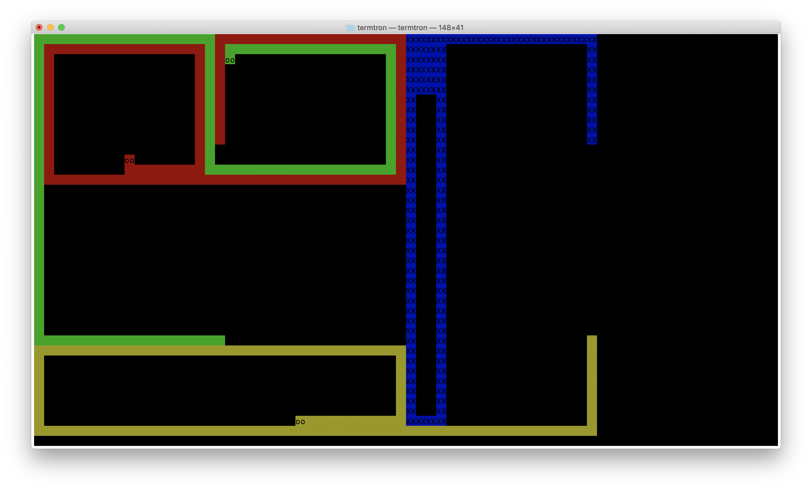

# TermTron

1 - 4 player game, which runs directly in the terminal.



Don't crash into edges, other players, or yourself. Last one standing is the winner.  
Concept taken from a game called [BMTron](https://www.games1729.com/archive/).

Uses [termbox-go](https://github.com/nsf/termbox-go) for most of the terminal interaction.

### Running

```
go get github.com/benrhyshoward/termtron
$GOPATH/bin/termtron
```

### Possible improvements
- System to keep track of how many rounds each player has won.
- Dockerise.
- Add tests.
- [termbox-go](https://github.com/nsf/termbox-go) isn't fully maintained anymore. Switch to another terminal library, maybe [tcell](https://github.com/gdamore/tcell).